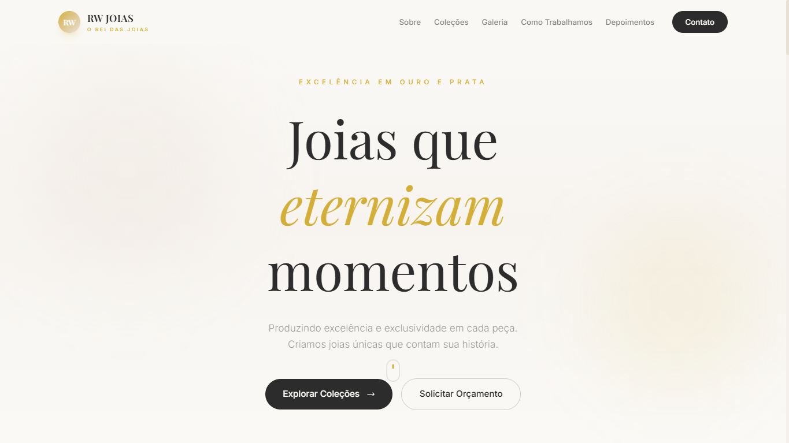

<div align="center">

  <!-- CAPA / BANNER -->
  

  <h1>✨ RW JOIAS — O Rei das Joias</h1>

  <p>
    <strong>Landing Page Premium</strong> para joalheria fictícia, desenvolvida com foco em <br/>
    elegância, performance e experiência do usuário.
  </p>

  <!-- BADGES DE TECNOLOGIAS -->
  <p>
    
    
    
    
    
  </p>

  <!-- BADGES DE DEPLOY E STATUS -->
  <p>
    
    
    
  </p>

  <!-- LINKS RÁPIDOS -->
  <p>
    <a href="#-visão-geral">📖 Visão Geral</a> •
    <a href="#-tecnologias">🛠️ Tecnologias</a> •
    <a href="#-funcionalidades">⚡ Funcionalidades</a> •
    <a href="#-como-rodar">🚀 Como Rodar</a> •
    <a href="#-deploy">🌐 Deploy</a>
  </p>

</div>

---

## 📖 Visão Geral

O **RW JOIAS** é uma landing page premium desenvolvida para uma joalheria fictícia, projetada para transmitir **sofisticação, exclusividade e confiança**. O projeto combina um design luxuoso baseado em tons de dourado, preto e branco com uma experiência interativa fluida, incluindo animações de scroll, modais de coleção, galeria com lightbox e navegação responsiva.

> 💡 **Objetivo:** Demonstrar a construção de um site moderno e responsivo utilizando **Vite**, **Tailwind CSS v4** e **JavaScript Vanilla**, com dados dinâmicos carregados via **JSON** externo.

### ✨ Destaques Visuais

| Hero Section | Coleções Interativas | Galeria Premium |
|:---:|:---:|:---:|
| Título elegante com gradiente dourado | Cards com hover e modal de detalhes | Slider com overlay e lightbox |
| Animação de float e scroll suave | WhatsApp integrado para compra | Navegação por teclado (setas/ESC) |

---

## 🛠️ Tecnologias

| Tecnologia | Versão | Função Principal |
|:---:|:---:|:---|
| **Vite** | v8.0+ | Build tool de próxima geração com HMR ultrarrápido |
| **Tailwind CSS** | v4.2+ | Framework utilitário para estilização responsiva |
| **PostCSS** | v8.5+ | Processamento de CSS com plugins (Tailwind + Autoprefixer) |
| **JavaScript** | ES6+ | Lógica de interatividade, modais, animações e fetch de dados |
| **HTML5** | — | Estruturação semântica e acessível |
| **JSON** | — | Armazenamento externo de dados (coleções e galeria) |
| **Font Awesome** | v6.5+ | Ícones premium para UI |
| **Google Fonts** | — | Tipografia Cinzel + Inter |

---

## ⚡ Funcionalidades

- 🎨 **Design Luxo** — Paleta premium com dourado `#D4AF37`, preto `#2C2C2C` e cream `#FAF9F6`
- 📱 **100% Responsivo** — Mobile-first, adapta-se de smartphones a desktops 4K
- 🖼️ **Galeria Interativa** — Slider com navegação por botões, indicadores e lightbox com suporte a teclado
- 🛍️ **Modal de Coleção** — Visualização detalhada de itens com slider interno e botão direto para WhatsApp
- ✨ **Scroll Reveal** — Animações suaves de entrada ao rolar a página (Intersection Observer)
- 📂 **Dados Dinâmicos** — Coleções e galeria carregadas de arquivo `data.json` externo
- 🍔 **Menu Mobile** — Navegação hamburguer com animação de abertura/fechamento
- ⌨️ **Acessibilidade** — Navegação por teclado no lightbox (ESC, setas), semântica HTML5

---

## 📁 Estrutura do Projeto

```text
rw-joias/
├── 📁 node_modules/          # Dependências (não versionar)
├── 📁 public/                # Assets estáticos
│   ├── data.json             # ⭐ Dados das coleções e galeria
│   └── rwjlogotipo2.png      # Logo da marca
├── 📁 src/
│   ├── main.js               # Lógica principal (fetch, render, modais)
│   └── style.css             # Tailwind + estilos customizados
├── index.html                # Ponto de entrada
├── package.json              # Scripts e dependências
├── vite.config.js            # Configuração do Vite (base path)
├── postcss.config.js         # Configuração PostCSS (Tailwind v4)
├── tailwind.config.js        # Tema customizado (cores, fontes, animações)
└── README.md                 # Este documento
```

---

## 🚀 Como Rodar

### Pré-requisitos

- [Node.js](https://nodejs.org/) v20+ (com npm)
- Git instalado

### Passo a passo

```bash
# 1. Clone o repositório
git clone https://github.com/SEU-USUARIO/rw-joias.git

# 2. Entre na pasta do projeto
cd rw-joias

# 3. Instale as dependências
npm install

# 4. Inicie o servidor de desenvolvimento
npm run dev
```

> O projeto estará disponível em `http://localhost:5173/rwjoias/` (ou porta alternativa).
> 
> 💡 O Vite oferece **Hot Module Replacement (HMR)** — alterações refletem instantaneamente!

### Scripts disponíveis

| Comando | Descrição |
|:---|:---|
| `npm run dev` | Inicia servidor de desenvolvimento com HMR |
| `npm run build` | Gera build otimizado para produção na pasta `dist/` |
| `npm run preview` | Pré-visualiza o build de produção localmente |
| `npm run deploy` | Faz deploy automático para GitHub Pages |

---

## 🌐 Deploy

### GitHub Pages (Recomendado)

O projeto já está configurado para deploy automático:

```bash
# Gera build e envia para GitHub Pages
npm run deploy
```

> ⚠️ Certifique-se de que `vite.config.js` tem `base: '/rwjoias/'` (nome do seu repositório).

### Outras opções

- **Netlify:** Conecte o repositório Git, build command: `npm run build`, publish directory: `dist`
- **Vercel:** Importe o repositório — a plataforma detecta automaticamente a configuração Vite

---

## 🎨 Personalização

### Trocar imagens das coleções

Edite `public/data.json`:

```json
{
  "collections": [
    {
      "id": "pulseira",
      "name": "Pulseiras",
      "image": "https://images.unsplash.com/photo-xxx",
      "items": [
        {
          "src": "https://images.unsplash.com/photo-yyy",
          "titulo": "Pulseira Grumet 18k",
          "preco": "R$ 4.250,00",
          "material": "Ouro 18k legítimo",
          "disponibilidade": "Pronta Entrega"
        }
      ]
    }
  ]
}
```

### Mudar cores do tema

Edite `tailwind.config.js`:

```javascript
colors: {
  gold: { 500: '#D4AF37' },    // Dourado principal
  cream: '#FAF9F6',             // Fundo claro
  charcoal: '#2C2C2C',        // Texto escuro
}
```

---

## 🐛 Solução de Problemas

| Problema | Solução |
|:---|:---|
| Coleções não aparecem | Verifique se `data.json` está em `public/` e o caminho no `main.js` está correto |
| CSS não atualiza | Limpe cache: `Ctrl + Shift + R` (Windows) / `Cmd + Shift + R` (Mac) |
| Imagens quebram no deploy | Use caminhos absolutos: `./data.json` ou URLs completas |
| Porta 5173 ocupada | Vite usa porta automática, ou force: `npm run dev -- --port 3000` |
| `npm install` falha | Delete `node_modules/` e `package-lock.json`, rode `npm install` novamente |

---

## 📚 Documentação Completa

Para um guia didático detalhado sobre cada tecnologia, configuração e decisão de design, consulte o **[Guia Completo — RW JOIAS](GUIA_COMPLETO.md)** incluído neste repositório.

Tópicos cobertos:
- Configuração do Vite e Tailwind CSS v4
- Anatomia do código (HTML, CSS, JS)
- Intersection Observer e animações
- GitHub e versionamento
- Deploy em múltiplas plataformas
- Análise de erros comuns e correções

---

## 📄 Licença

Este projeto está licenciado sob a [Licença MIT](LICENSE).

---

<div align="center">

  <p>💎 Desenvolvido com dedicação por <strong>David Gilmour</strong></p>
  <p>
    <a href="https://github.com/dgilmourcode" target="_blank">GitHub</a> •
    <a href="https://linkedin.com/in/dgilmourcode" target="_blank">LinkedIn</a> •
    <a href="https://instagram.com/rwjoiassthe" target="_blank">Instagram RW Joias</a>
  </p>

  <p><em>Transformando código em joias digitais ✨</em></p>

</div>
automaticamente o Vite e fará o deploy.

### 10.3. Vercel (Gratuito)

A Vercel é outra excelente plataforma para deploy de front-ends, conhecida por sua facilidade de uso e integração com frameworks modernos como o Vite.

**Método 1: Deploy via Vercel CLI**

1.  **Instale o Vercel CLI globalmente:**
    ```bash
    npm i -g vercel
    ```
2.  **Faça o deploy:**
    ```bash
    vercel
    ```
    Siga as instruções para vincular seu projeto e fazer o deploy.

**Método 2: Integração com Git (Recomendado)**

1.  **Envie seu código para o GitHub:** Seu projeto deve estar no GitHub.
2.  **Faça login no Vercel:** Acesse [vercel.com](https://vercel.com/) e faça login.
3.  **Importe seu projeto:** Clique em "Add New..." -> "Project" -> "Import Git Repository" e selecione seu repositório `rw-joias`.
4.  **Configurações de Build:** A Vercel geralmente detecta automaticamente que é um projeto Vite e configura o comando de build (`npm run build`) e o diretório de saída (`dist`) corretamente. Confirme as configurações e clique em "Deploy".

---

## 🛠️ Análise de Erros

Esta seção é crucial para o seu aprendizado. Ela detalha os problemas encontrados no projeto original, explica por que eles ocorriam e como foram corrigidos, transformando-os em lições valiosas.

### 11.1. Erro de CSS (PostCSS)

**Onde você errou:** No arquivo `src/style.css`, havia um bloco `@layer utilities {` que **não foi fechado** corretamente com a chave `}`. Além disso, algumas classes customizadas (como `.bg-gradient-gold`) estavam duplicadas, aparecendo tanto dentro de um `@layer` quanto soltas no arquivo.

**Por que dava erro:** O PostCSS (a ferramenta que processa o seu CSS, incluindo o Tailwind) é muito rigoroso com a sintaxe. Um bloco CSS não fechado ou uma estrutura inválida faz com que ele não consiga parsear o arquivo, resultando em um erro `CssSyntaxError: Unclosed block` durante o `npm run build` ou `npm run dev`. A duplicação de classes, embora não cause um erro de build, aumenta o tamanho do arquivo CSS e pode levar a comportamentos inesperados devido à especificidade do CSS.

**Como foi reparado:**
- Todas as chaves (`{}`) dos blocos `@layer` foram fechadas corretamente.
- As classes CSS customizadas duplicadas foram removidas, mantendo apenas a definição dentro do `@layer` apropriado (`@layer components` ou `@layer utilities`).
- O arquivo `src/style.css` foi reorganizado para seguir a [Regra de Ouro de Ordem](#53-o-css-organizado-srcstylecss) para imports e `@layer`s.

### 11.2. Importação do CSS no HTML

**Onde você errou:** No `index.html`, o CSS estava sendo importado da maneira tradicional, usando a tag `<link rel="stylesheet" href="src/style.css">`.

**Por que dava erro:** Em projetos Vite (especialmente com `type="module"` no script principal), o Vite espera que o CSS seja importado via JavaScript (ex: `import './style.css';` no `main.js`). Isso permite que o Vite otimize o CSS, aplique o Hot Module Replacement (HMR) e processe-o corretamente com o PostCSS/Tailwind. Incluir o CSS via `<link>` no HTML pode fazer com que o Tailwind não seja processado ou que o HMR não funcione para estilos.

**Como foi reparado:**
- A tag `<link rel="stylesheet" href="src/style.css">` foi removida do `index.html`.
- A linha `import './style.css';` foi adicionada no início do arquivo `src/main.js`, delegando a importação do CSS ao pipeline do Vite.

### 11.3. Funções de Modal não Acessíveis (Scope Issue)

**Onde você errou:** No `index.html`, os elementos que abriam o modal usavam atributos `onclick` como `onclick="openModal('id')"`. No entanto, as funções `openModal` e `closeModal` estavam declaradas dentro do `src/main.js` sem serem expostas globalmente.

**Por que dava erro:** Quando você usa `<script type="module">` (como é o padrão no Vite), todo o JavaScript dentro desse módulo é isolado em seu próprio escopo. Isso significa que funções declaradas dentro de `main.js` não são automaticamente acessíveis a partir do escopo global do navegador (onde o `onclick` do HTML tenta encontrá-las). Consequentemente, clicar nos elementos não disparava as funções do modal.

**Como foi reparado:** No final do arquivo `src/main.js`, as funções `openModal` e `closeModal` foram explicitamente anexadas ao objeto `window`, tornando-as acessíveis globalmente:

```javascript
window.openModal = openModal;
window.closeModal = closeModal;
```

### 11.4. Configuração Incompleta do Tailwind v4

**Onde você errou:** O projeto estava utilizando o Tailwind CSS versão 4.2.2, mas o arquivo `postcss.config.js` não estava configurado para usar o plugin correto para esta versão.

**Por que dava erro:** O Tailwind CSS passou por mudanças significativas em sua arquitetura na versão 4. Ele não é mais um plugin PostCSS "direto" como nas versões anteriores. Em vez disso, ele requer o pacote `@tailwindcss/postcss` para ser processado corretamente pelo PostCSS. A ausência ou configuração incorreta deste plugin resultava em erros de build e no não processamento das classes Tailwind.

**Como foi reparado:**
- O pacote `@tailwindcss/postcss` foi instalado como uma dependência de desenvolvimento (`npm install -D @tailwindcss/postcss`).
- O arquivo `postcss.config.js` foi atualizado para incluir o plugin `@tailwindcss/postcss` em sua configuração, garantindo que o Tailwind v4 seja processado corretamente.

### 11.5. Ordem dos Imports no CSS

**Onde você errou:** O `@import url(...)` das fontes do Google Fonts estava localizado no meio do arquivo `src/style.css`, após as diretivas `@tailwind`.

**Por que dava erro:** A especificação do CSS exige que todas as regras `@import` sejam as **primeiras** declarações em um arquivo CSS (com exceção de `@charset`). Quando um `@import` aparece depois de outras regras (como `@tailwind`), o PostCSS e o navegador podem reportar um erro de sintaxe ou simplesmente ignorar a importação, fazendo com que as fontes não sejam carregadas.

**Como foi reparado:** A linha `@import url(...)` foi movida para o topo do arquivo `src/style.css`, antes de todas as diretivas `@tailwind`.

### 11.6. Melhorias Visuais Adicionais

Aproveitamos as correções para aplicar algumas melhorias visuais que modernizam o layout e a experiência do usuário, mantendo a estrutura original do seu projeto:
- **Navbar com Sombra:** Adicionada uma sombra sutil (`shadow-lg shadow-gold-500/10`) à barra de navegação para realçar o efeito de vidro e dar mais profundidade.
- **Título do Hero Aprimorado:** O título principal na seção Hero recebeu um emoji (`✨`) e uma sombra de texto (`drop-shadow-lg`) para maior impacto visual e legibilidade sobre a imagem de fundo.
- **Botões Interativos:** Os botões na seção Hero foram aprimorados com efeitos de escala (`hover:scale-110`) e um `backdrop-blur` para o botão de orçamento, tornando-os mais dinâmicos e convidativos.
- **Indicador de Scroll Animado:** O ícone de seta para baixo na seção Hero agora tem uma animação de pulso (`animate-bounce`) e um efeito de escala ao passar o mouse (`hover:scale-125`), incentivando o usuário a rolar a página.

---

## 🚀 Próximos Passos

Para continuar seu aprendizado e aprimorar este projeto, aqui estão algumas ideias e sugestões:

1.  **Implementar Dark/Light Mode:** Adicione um botão para alternar entre um tema escuro e um tema claro, utilizando variáveis CSS ou classes Tailwind dinâmicas. Isso é uma ótima prática de acessibilidade e personalização.
2.  **Filtros de Coleção Dinâmicos:** Crie botões ou um menu suspenso para filtrar as joias por tipo (pulseiras, colares, anéis) sem recarregar a página, utilizando JavaScript para manipular a exibição dos elementos.
3.  **Integração com WhatsApp:** Adicione um botão flutuante que, ao ser clicado, abre o WhatsApp com uma mensagem pré-preenchida para solicitar um orçamento rápido. Isso melhora a conversão e a comunicação com o cliente.
4.  **Otimização de Imagens:** Explore ferramentas como [Cloudinary](https://cloudinary.com/) ou [TinyPNG](https://tinypng.com/) para otimizar as imagens do projeto, reduzindo o tempo de carregamento e melhorando a performance geral.
5.  **Adicionar Testes Automatizados:** Comece a escrever testes unitários para as funções JavaScript mais importantes (ex: `openModal`, `closeModal`). Ferramentas como [Vitest](https://vitest.dev/) são excelentes para projetos Vite.
6.  **Refatorar JavaScript:** Considere organizar o `main.js` em módulos menores (ex: `modal.js`, `navbar.js`, `animations.js`) e importá-los no `main.js`. Isso melhora a legibilidade e a manutenção do código.
7.  **SEO Básico:** Adicione meta tags (`<meta name="description" content="...">`, `<meta name="keywords" content="...">`) e otimize os atributos `alt` das imagens para melhorar a visibilidade do site em motores de busca.
8.  **Animações Avançadas:** Explore bibliotecas de animação JavaScript como [GSAP](https://gsap.com/) ou [Framer Motion](https://www.framer.com/motion/) para criar efeitos visuais ainda mais sofisticados.

---

<div align="center">

  <p>💎 Desenvolvido com dedicação por <strong>David Gilmour</strong></p>
  <p>
    <a href="https://github.com/dgilmourcode" target="_blank">GitHub</a> •
    <a href="https://linkedin.com/in/dgilmourcode" target="_blank">LinkedIn</a> •
    <a href="https://instagram.com/rwjoiassthe" target="_blank">Instagram RW Joias</a>
  </p>

  <p><em>Transformando código em joias digitais ✨</em></p>

</div>
